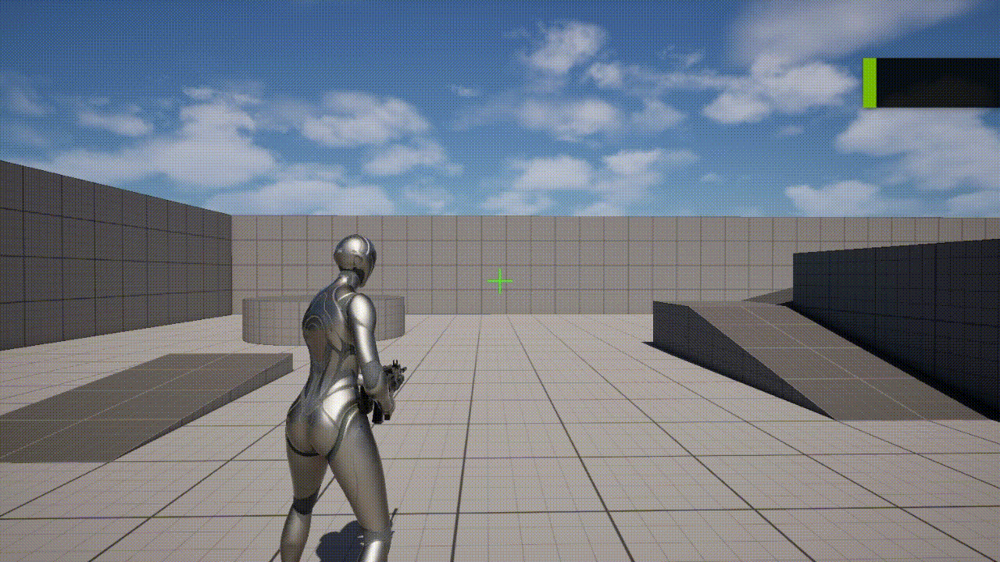
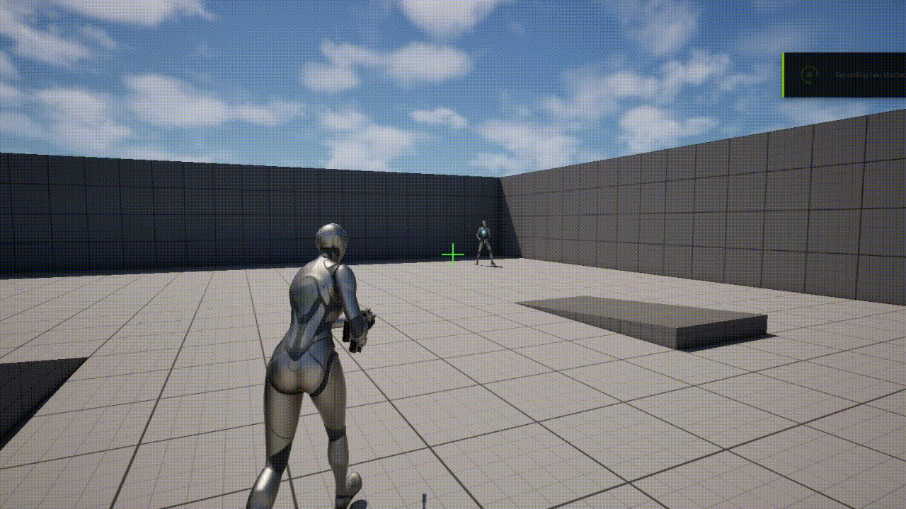

# Shootisfy (TPS)

A **third-person shooter prototype** built in **Unreal Engine 5.3**, focused on **tight shooting feel, responsive gunplay, and short tactical rounds** in a compact arena-style map.

This project was developed as a **portfolio piece**, prioritizing **player satisfaction while shooting** over feature breadth.

---

## 🎯 Core Concept

Shootisfy is a **round-based third-person shooter** inspired by the pacing and tension of games like CS, reimagined from a third-person perspective.

- Small, readable map
- Short, repeatable rounds
- Fast feedback on every shot
- Minimal mechanics, maximum polish

The goal is simple:  
**every shot should feel responsive, impactful, and intentional.**

---

## 🔫 Key Gameplay Features

- **Third-Person Shooter Camera**
  - Over-the-shoulder framing
  - Camera lag and smoothing for weight and control

- **Hitscan Weapon System**
  - Line trace-based shooting
  - Camera-aligned aiming
  - Immediate hit feedback

- **Round-Based Gameplay**
  - Enemies spawn in rounds
  - Clear win / lose conditions
  - Short session design

- **Combat Feedback (Game Feel Focus)**
  - Muzzle flash and impact VFX
  - Camera shake on fire and hit
  - Hit sounds and visual confirmation
  - Fire rate control to prevent spam

---

## 🛠️ Technical Details

- **Engine:** Unreal Engine 5.3
- **Framework:** Blueprint-only (no C++)
- **Perspective:** Third Person Shooter
- **Weapon Type:** Hitscan (Line Trace)
- **AI:** Simple enemy logic (move → shoot → die)
- **Scope:** Single small map, single weapon

This project deliberately avoids overengineering (ADS systems, loadouts, progression, multiplayer) to keep the focus on **core shooter fundamentals**.

---

## 📌 Design Philosophy

This project follows three strict principles:

1. **Feel over Features**  
   A small system that feels good beats a large system that feels unfinished.

2. **Clarity over Complexity**  
   The player should always understand why they hit or missed.

3. **Polish over Scale**  
   One map, one weapon, refined until it feels solid.

---

## 🎥 Gameplay Highlights

### Over-the-Shoulder Aiming
Responsive camera alignment with controlled shoulder offset and camera lag for stable aiming.

---

### Hitscan Shooting & Hit Feedback
Line trace-based shooting with immediate visual and audio feedback on impact.

---

### Over-the-Shoulder Movement
Smooth third-person locomotion tuned for shooter pacing and camera clarity.

---

## 🚧 Current Status

- Core shooting mechanics implemented
- Damage and hit feedback working
- Enemy placeholders active
- Ongoing polish on Shootisfy and pacing

---

## 🔮 Planned Improvements (Post-Prototype)

- Basic reload mechanic
- Improved enemy behavior per round
- UI polish (round counter, health)
- Additional visual feedback on hits

This project is part of a focused effort to build **strong gameplay-first portfolio pieces**.
